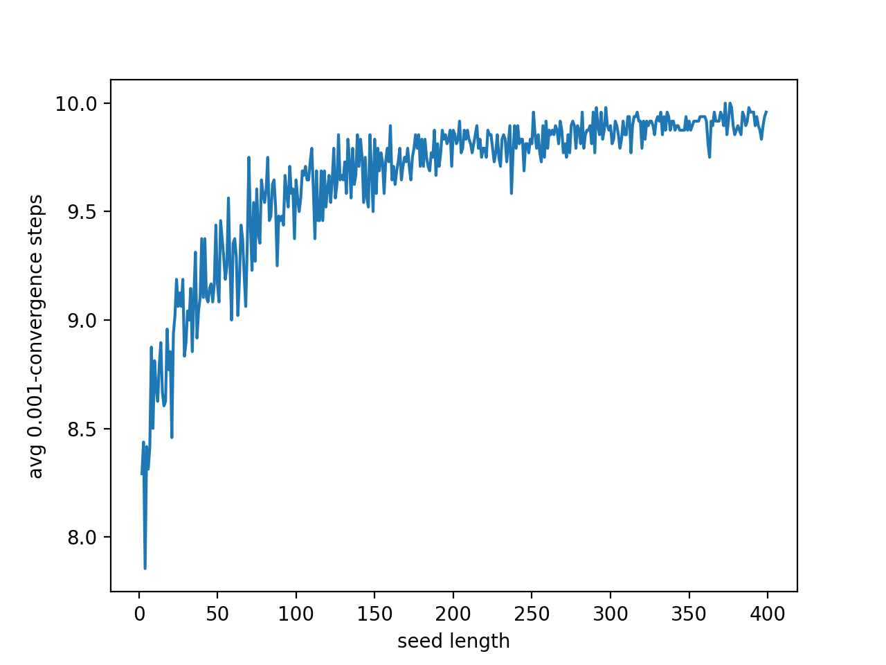

# Geomethic Meandian

An exploration of the convergence properties of repeatedly taking the mean, median, and other "centralizing" values and seeing how the values converge. This is inspired by [xckd 2435](https://xkcd.com/2435/).

This should be fairly extensible so you can set your own seed list, iterations, and metrics to use. The plot truncates the history at the point where the values sufficiently converge (within a given `epsilon`).

You can see, for example, the average time to converging within `ε = 0.001` for the arithmetic mean, geometric mean, and median (as in the xkcd):

